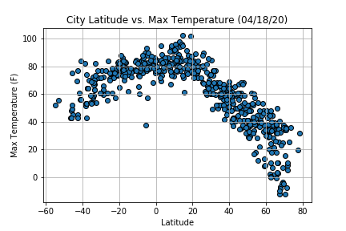
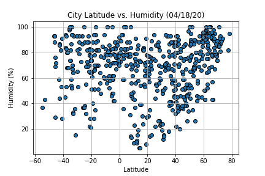
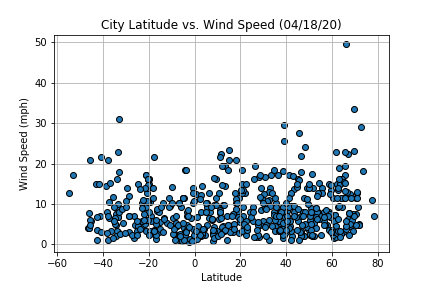
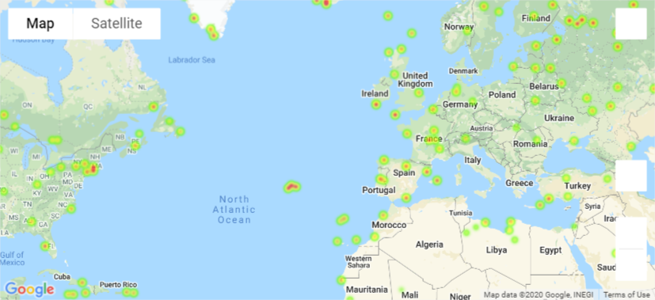
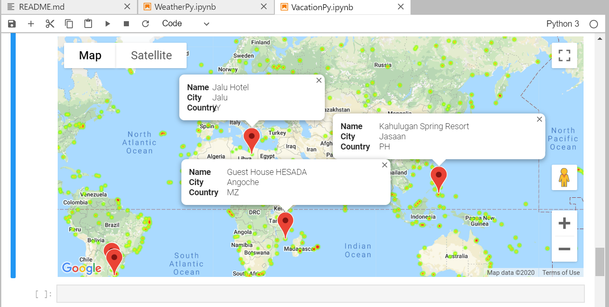

# Global Weather Review
This project reviews the weather elements such as cloudiness, temperature, humidity and wind speed of over 600 cities across the northern and southern hemispheres of the globe to gain insights on the state of the world's weather

# Tools
Working with OpenWeather and Google Maps APIs, analysing and visualising their data with Python and Matplotlib

# What's the weather like as we approach the equator?
I plotted a graph of the maximum temperatures against the latitudes of over 600 cities.
Based on the plot below, we can see that temperature rises as we get closer to the equator

In addition, the northern hemisphere is generally more humid than the southern hemisphere

...while wind speed rises the farther we get from the equator

# Vacation cities with the nicest weather?
Using OpenWeather API, I was able to determine cities with the following weather conditions
* A max temperature lower than 80 degrees but higher than 70
* Wind speed less than 10 mph
* Zero cloudiness

And then, using Google Maps Places API, I was able to determine hotels and vacations spots in those cities. We are vacation ready!

